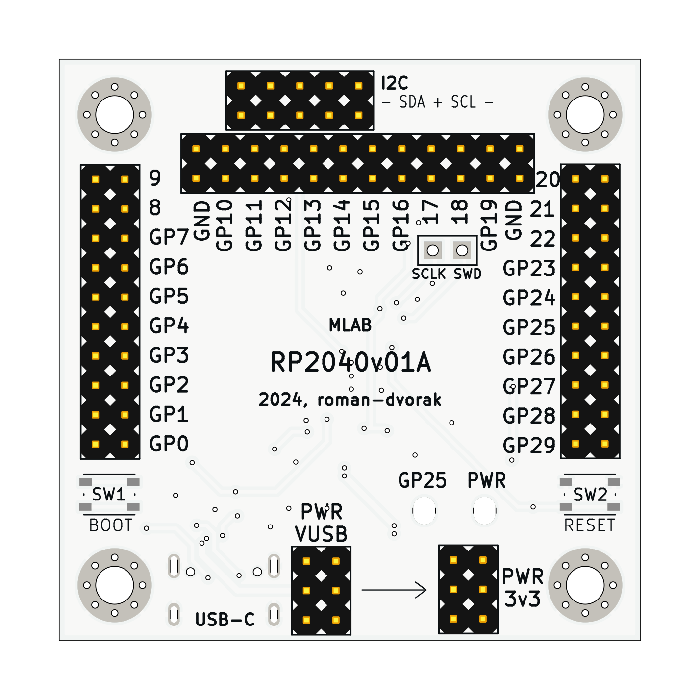

# RP2040v01 - RP2040 processor module

The MLAB module RP2040v01 featuring the RP2040 processor is a powerful and flexible development board designed for a wide range of applications. The RP2040 is a microcontroller from the Raspberry Pi Foundation, offering dual Arm Cortex-M0+ cores and extensive peripheral support.

